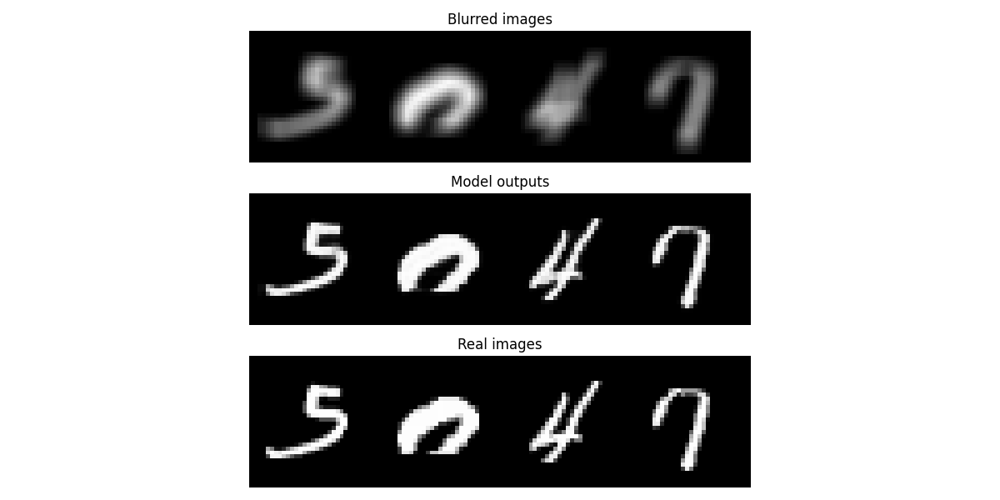

# Auto-encoders

One of the early generative models, able to create totally new images by picking a random vector in the latent space (i.e. the bottleneck of the model) 
  
Below are examples of what we can do with a simple auto-encoder. For instance, we can unblur or recolorize an image.

### Work to do:
- [x] implement pipeline to colorize image
- [x] implement pipeline to unblur image
- [ ] implement pipeline to create new numbers (random vectors in latent space using MNIST) (AE without skip connections)
- [ ] create VAE