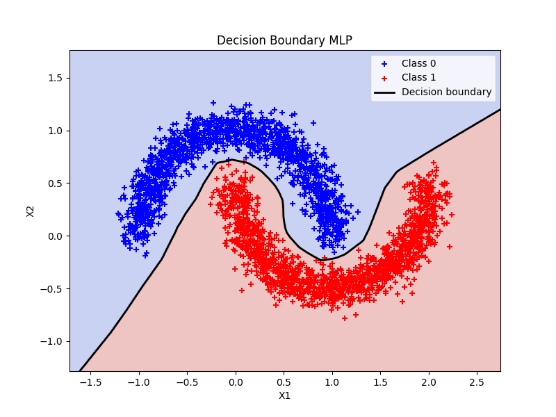

# MLP from scratch using numpy

This first project is an implementation of a MultiLayer Perceptron or MLP, one of the simplest deep learning models, using only numpy. It allowed me to understand precisely the concept of backpropagation in the context of machine learning and the mathematics behind this process.  
To test this implementation, we can choose from three different datasets in the `config.yaml` file.  

An example of our model results on the "moons" dataset is presented just below:
