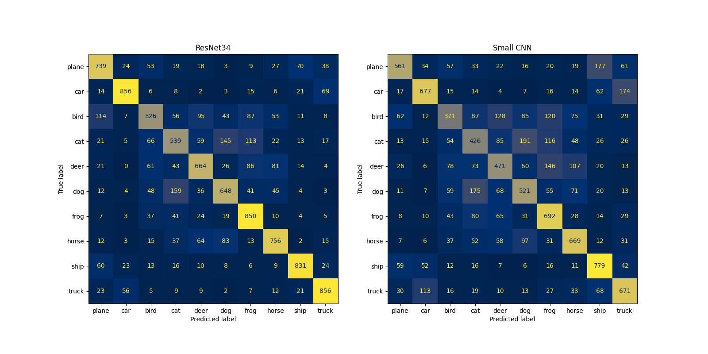
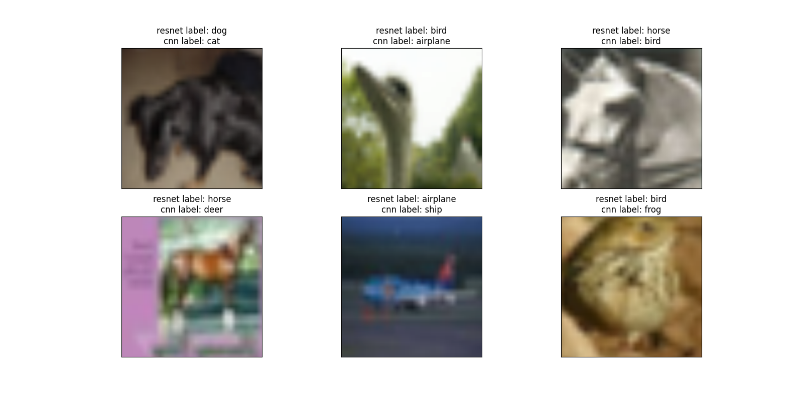

# ResNet implementation

This project is based on the paper [Deep Residual Learning for Image Recognition](https://arxiv.org/pdf/1512.03385) from Kaiming He, Xiangyu Zhang, Shaoqing Ren, and Jian Sun.  

ResNet is a deep convolutional neural network architecture that introduced the concept of residual learning. By adding shortcut (or skip) connections, ResNet allows gradients to flow more easily through deeper networks, addressing the vanishing gradient problem. This innovation enables the training of very deep networks, such as ResNet-50 or ResNet-101, while maintaining strong performance in image classification and other vision tasks.  
I have chosen to implement ResNet-34, a model with more than 21 millions parameters.  

## Results

You can find below the outcome on CIFAR10 of the ResNet model compared to a simple CNN that has only ~67K parameters.  
Looking at the confusion matrices, we can clearly see that the ResNet outperforms the CNN.  

The second visualization represents some of the inputs that have been misclassified by the CNN but not by the ResNet.  

