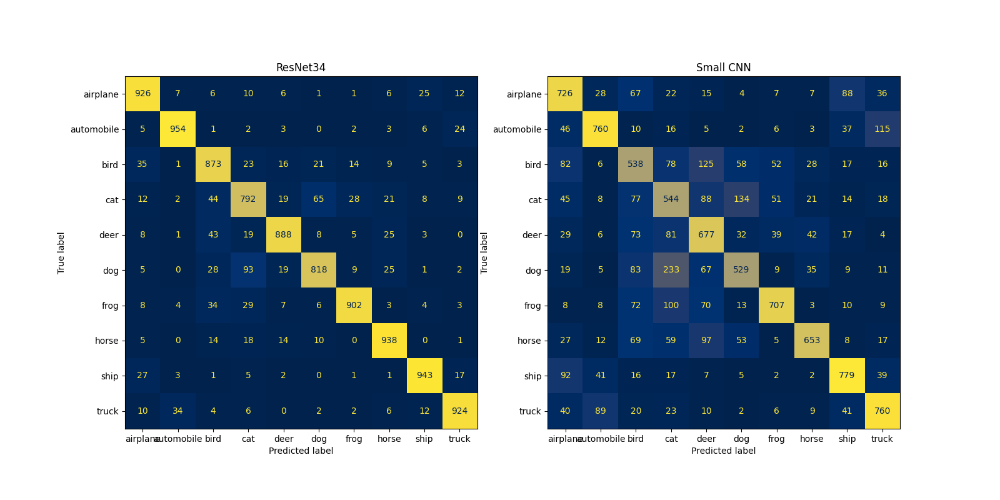
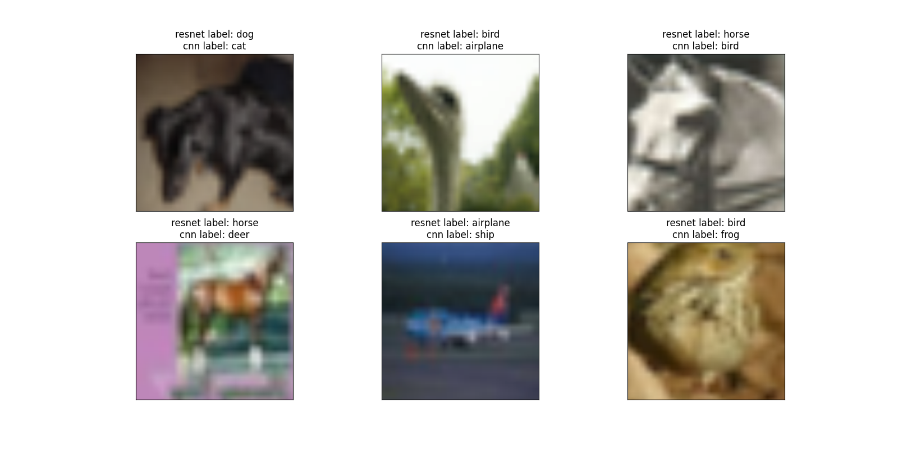
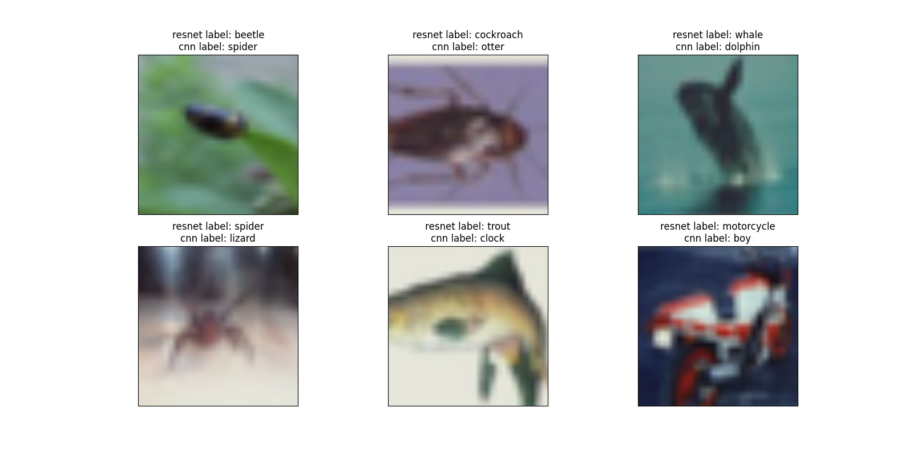

# ResNet implementation

This project is based on the paper [Deep Residual Learning for Image Recognition](https://arxiv.org/pdf/1512.03385) from Kaiming He, Xiangyu Zhang, Shaoqing Ren, and Jian Sun.  

ResNet is a deep convolutional neural network architecture that introduced the concept of residual learning. By adding shortcut (or skip) connections, ResNet allows gradients to flow more easily through deeper networks, addressing the vanishing gradient problem. This innovation enables the training of very deep networks, such as ResNet-50 or ResNet-101, while maintaining strong performance in image classification and other vision tasks.  
I have chosen to implement ResNet-34, a model with more than 21 millions parameters.  


## How to Use


To run the training and visualization script, use the `main.py` file with the following command-line arguments:


```bash

python main.py [--dataset DATASET] [--train TRAIN] [--epochs EPOCHS] [--patience PATIENCE] [--batch_size BATCH_SIZE] [--lr LR]

```


Here are the available arguments:


*   `--dataset`: Specifies the dataset to use. 
    *   **Type**: `str`
    *   **Choices**: `CIFAR10`, `CIFAR100`
    *   **Default**: `CIFAR10`
    *   **Purpose**: Determines which CIFAR dataset (CIFAR10 or CIFAR100) will be used for training and evaluation.


*   `--train`: A flag to indicate whether to train the models.
    *   **Type**: `bool`
    *   **Default**: `True`
    *   **Purpose**: If `True`, the models will be trained from scratch. If `False`, pre-trained models (if available) will be loaded for visualization.


*   `--epochs`: The number of epochs for training.
    *   **Type**: `int`
    *   **Default**: `100`
    *   **Purpose**: Sets the maximum number of training iterations over the entire dataset.


*   `--patience`: Patience for early stopping.
    *   **Type**: `int`
    *   **Default**: `5`
    *   **Purpose**: The number of epochs to wait for improvement in validation loss before stopping training early.


*   `--batch_size`: Batch size for training.
    *   **Type**: `int`
    *   **Default**: `32`
    *   **Purpose**: Defines the number of samples processed before the model's internal parameters are updated.


*   `--lr`: Learning rate for training.
    *   **Type**: `float`
    *   **Default**: `1e-3`
    *   **Purpose**: Controls the step size at each iteration while moving towards a minimum of the loss function.


## Results

You can find below the outcome of the ResNet model compared to a simple CNN that has only ~67K parameters.

### Loss and accuracy

Here are the performance of both models on CIFAR10 and CIFAR100 test sets

#### CIFAR10
| Model  | Best loss | Best accuracy |
| ------------- | ------------- | ------------- |
| CNN  | Content Cell  | Content Cell  |
| ResNet-34  | Content Cell  | Content Cell  |


#### CIFAR100
| Model  | Best loss | Best accuracy |
| ------------- | ------------- | ------------- |
| CNN  | Content Cell  | Content Cell  |
| ResNet-34  | Content Cell  | Content Cell  |

### Visualizations
  
Looking at the confusion matrices on CIFAR10, we can clearly see that the ResNet outperforms the CNN.  




The second visualization represents some of the inputs that have been misclassified by the CNN but not by the ResNet, first on CIFAR10 and then on CIFAR100.  






